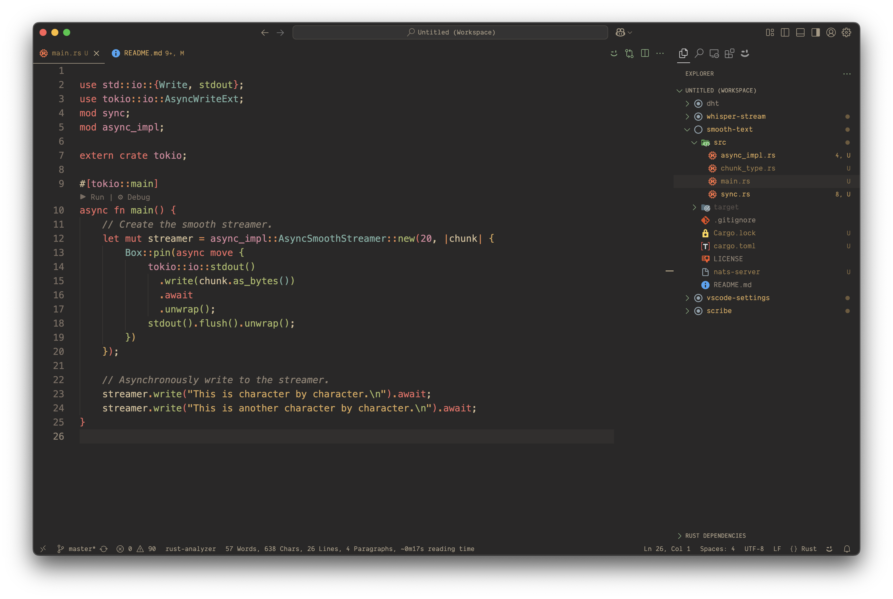

   

  

  
  

  

    <samp>&nbsp;&nbsp;&nbsp;&nbsp;&nbsp;&nbsp;&nbsp;&nbsp;&nbsp;&nbsp;&nbsp;Theme | <a href="https://marketplace.visualstudio.com/items?itemName=sainnhe.gruvbox-material">Gruvbox Dark</a> 
    &nbsp;&nbsp;&nbsp;&nbsp;&nbsp;&nbsp;&nbsp;&nbsp;&nbsp;Font | <a href="https://philpl.gumroad.com/l/dank-mono">Dank Mono</a> 
    &nbsp;&nbsp;&nbsp;&nbsp;&nbsp;&nbsp;&nbsp;&nbsp;File Icons | <a href="https://marketplace.visualstudio.com/items?itemName=PKief.material-icon-theme">Material Icons</a> 
    &nbsp;&nbsp;&nbsp;&nbsp;&nbsp;&nbsp;&nbsp;&nbsp;Extensions | <a href="./extensions.txt">Open Text File</a> 
    &nbsp;&nbsp;&nbsp;&nbsp;&nbsp;&nbsp;&nbsp;VSCode Settings | <a href="./settings.json">Open Settings File</a>
    
  

  
